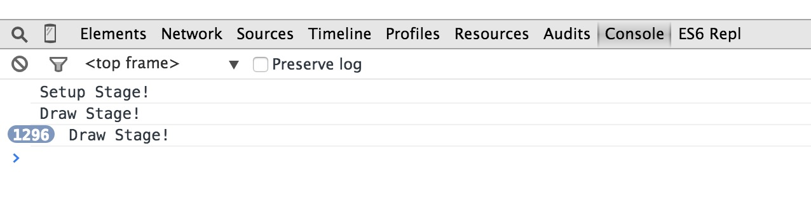
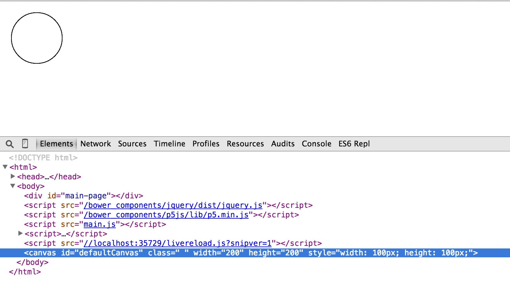
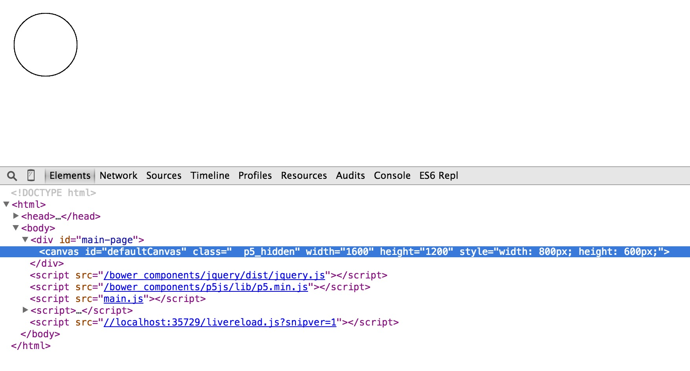
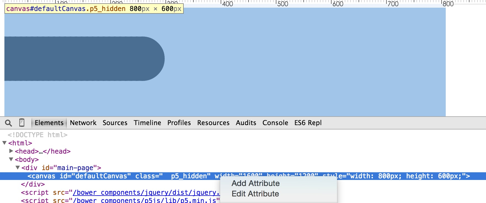
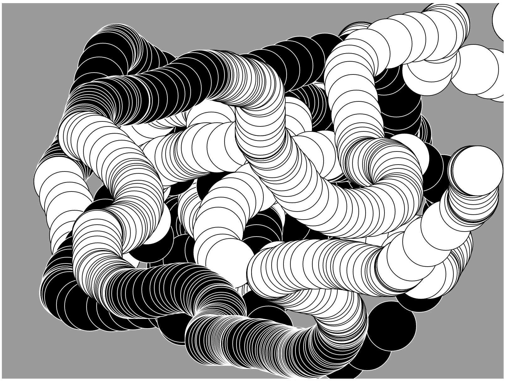

## 介绍

### 什么是Processing？

Processing是一门专注于具有交互性数据可视化的编程语言，在平面设计，艺术创作，交互原型设计，新媒体，建筑规划，图像处理，开源硬件等领域有着广泛的应用；同时，Processing可以让人们在视觉环境下学习编程，并且语法简单上手快，为很多人打开了学习编程的大门，号称是最适合零基础编程入门的语言。

### Processing有什么特点？

*   免费，开源
*   可以编写2D/3D交互性程序，并可导出pdf文件
*   OpenGL 3D 加速集成
*   超过100个库对核心内容进行了扩展
*   健全的文档和学习书籍

## Processing.js和p5.js

Processing定义了一套语法规范，默认使用Java语言进行数据可视化代码的编写，主要通过PDE(Processing Development Environment)工具进行代码的开发(Processing也可以使用其他编程语言进行开发，在PDE中可以选择具体的开发语言)。

我们关注核心点放在Processing在前端开发中的应用，因此不适用PDE进行开发。

在前端领域目前存在两个Processing相关的JS框架：Processing.js和p5.js，两个框架的侧重点不同。

*   Processing.js侧重点将已有的Processing文件(即通过PDE生成的.pde文件)转换为前端可识别的js代码并在canvas中进行展示，也就是说其可以很方便的引用已有pde文件在页面中进行数据可视化的生成，缺点在于不能很好的使用原生js代码直接进行编码。
*   p5.js是Processing原生js的接口库，可以很方便的使用javascript进行代码编辑，也就是说我们可以通过p5.js直接在javascript中写processing源码。

因此，接下来的内容主要是通过p5.js来进行Processing的学习。


## p5.js安装和环境搭建


想在页面中引用p5.js进行processing代码的编写非常简单，只需要将p5.js引用到页面中

```html
<script src="../p5.min.js"></script>
```

也可以使用p5.js推荐的cdn

```html
<script src="//cdnjs.cloudflare.com/ajax/libs/p5.js/0.0.0/p5.js"></script>
```

为了使调试方便，我在Github上创建了这个文档学习项目，clone并初始化该项目，可以更方便的学习和调试源码，具体的环境搭建介绍如下：

```bash
git clone https://github.com/wh1100717/p5_learning
cd p5_learning
npm install && bower install
```

> 注： 在天朝这个神奇的地方，npm可能会巨慢无比，可以考虑使用cnpm进行代替，cnpm的具体使用方式查看[cnpm官网](http://www.cnpmjs.org/) 或 [快速搭建 Node.js 开发环境以及加速 npm](https://cnodejs.org/topic/5338c5db7cbade005b023c98)

项目文件结构如下：

*   bower_components/   //由bower install生成，包含所需要的js verndor库文件
*   demos/              //具体的代码示例放在该文件夹中
*   docs/               //文档放在该文件夹下
*   node_modules/       //由npm/cnpm install生成，包含基于node的工具

## 第一个小示例

打开demos/d1文件夹，存在两个文件，index.html和main.coffee

index.html文件中引用了p5.min.js文件及main.js文件，除此之外没有其他内容。

```html
<!doctype html>
<!-- index.html -->
<html>
<head>
    <meta charset="utf-8">
    <title>p5_learning</title>
</head>
<body>
    <script src="/bower_components/p5js/lib/p5.min.js"></script>
    <script src="main.js"></script>
</body>
</html>
```

我们来看一下main.coffee中都做了什么事情：

*   定义函数`setup()`，只是输出`Setup Stage!`字符串。
*   定义函数`draw()`，只是输出`Draw Stage!`字符串。

```coffee
# d1/main.coffee
setup = ->
    console.log("Setup Stage!")
draw = ->
    console.log("Draw Stage!")
```

执行`grunt`然后在浏览器中打开`http://localhost:9008/demos/d1/`会发现`Setup Stage!`打印了1次，而`Draw Srage`一直在输出内容。

结果显示如下：



我们可以看出这两个函数的作用：`setup()`进行初始化，`draw()`持续一直执行重绘操作。

---

我们在main.coffee中增加一些内容

```coffee
# d1/main.coffee
setup = ->
    console.log("Setup Stage!")
draw = ->
    console.log("Draw Stage!")
    ellipse(50, 50, 80, 80)
```

结果显示如下：



这时候浏览器会自动刷新，并在左上角显示了一个圆形。我们查看页面Html会发现，页面中增加了如下代码：

```html
<canvas id="defaultCanvas" class=" " width="200" height="200" style="width: 100px; height: 100px;"></canvas>
```

p5.js自动生成了一个默认canvas画布，并在该画布上花了一个圆。

---

如果想在指定div下生成一个宽800px高600px的canvas画布，可以使用如下方式：

```html
<body>
    <div id="main-page"></div>
    ...
```

```coffee
setup = ->
    console.log("Setup Stage!")
    createCanvas(800, 600).parent("main-page")
draw = ->
    console.log("Draw Stage!")
    ellipse(50, 50, 80, 80)
```

结果显示如下：



此时，在id为main-page的div下生成了一个宽800px，高600px的canvas画布。

---

我们可以使用如下代码让小球动起来：

```coffee
x = 0
setup = ->
    console.log("Setup Stage!")
    createCanvas(800, 600).parent("main-page")
draw = ->
    console.log("Draw Stage!")
    fill(0)
    ellipse(x, 100, 80, 80)
    x = if x >= 800 then 0 else x + 10
```

结果显示如下：



我们可以看到小球从左向右移动并最终填满整个横向区域。

---

接下来增加一些与用户的交互内容。

```coffee
setup = ->
    createCanvas(800, 600).parent("main-page")
    background(155)

draw = ->
    fill if mouseIsPressed then 0 else 255
    ellipse(mouseX, mouseY, 80, 80) if mouseX isnt 0 and mouseY isnt 0
```

结果显示如下：



小球移动的地方会产生一个小球，当鼠标按下时显示为黑色，没有按下时显示为白色。
