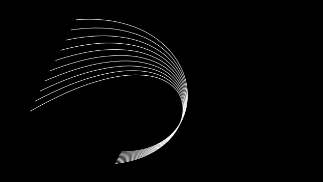
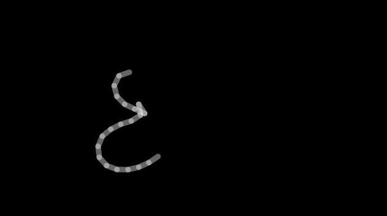

## p5.js和Processing的不同之处

*   实际上创建sketch画板可能会有不同种的实现，而在Processing中通过`size()`函数来创建，而在p5.js为了保持使用其他元素来创建画板的可能性，使用`createCanvas()`来替代`size()`函数，并作为默认的画板。
*   `frameRate(num)` 设置了frame rate, 该函数用于改变和控制每秒显示的帧数。而在p5.js中移除了`frameRate`变量，如果想获取当前帧数，可以调用`frameRate()`函数来获得。
*   Javascript并不总是进行同步加载，以下方案来解决这个问题：
    *   所有的方法都有一个可选的回调函数作为传参，
    *   除此之外，也可以在`setup()`函数之前使用`preload()`函数来提前加载代码。
*   `mousePressed`被`mouseIsPressed`变量代替
*   额外增加了一些touch相关的鼠标时间，类似的映射关系如下：
    *   mouseX ~ touchX
    *   mouseY ~ touchY
    *   mousePressed() ~ touchStarted()
    *   mouseDragged() ~ touchMoved()
    *   mouseReleased() ~ touchEnded()
    *   `touches[]`数组包含了一系列包含与手指一一对应的x和y位置属性的对象。
*   `push/popMatrix()` 和 `push/popStyle()`方法被`push()`和`pop()`取代。
*   默认情况下，所有的变量会在全局作用域下。如果想使用被称之为"instance mode"的方式来创建p5画板，请参考[instance mode example](http://p5js.org/learn/examples/Instance_Mode_Instantiation.php) 和 [global vs instance mode tutorial](https://github.com/lmccart/itp-creative-js/wiki/Week-5#global-and-instance-mode).
*   p5.js并没有实现Processing中的所有特性(正在努力实现中....)，目前3D, PShape和PFont相关的内容还没有实现。可以参考[reference](http://p5js.org/reference/)来查看最新文档中哪些特性被实现。

## 转化示例

### Basic sketch

```java
void setup(){
    // setup stuff
}
void draw(){
    // draw stuff
}
```

对应的js代码则为:

```javascript
function setup(){
    // setup stuff
};
function draw(){
    // draw stuff
};
```

我们通过两个示例来查看Processing代码是如何转换为p5.js代码的。

```javascript
/**
 * This example can be found in the Processing examples package
 * that comes with the Processing PDE.
 * Processing > Examples > Basics > Form > Bezier
 * Adapted by Evelyn Eastmond
 */
function setup() {     // 修改 void setup() 为 function setup()
  createCanvas(640, 360);    // 修改 size() 为 createCanvas()
  stroke(255);               // stroke() 保持不变
  noFill();                  // noFill() 保持不变
}
function draw() {     // 修改 void draw() 为 function draw()
  background(0);      // background() 保持不变
  for (var i = 0; i < 200; i += 20) {     // 修改 int i 为 var i
    bezier(mouseX-(i/2.0), 40+i, 410, 20, 440, 300, 240-(i/16.0), 300+(i/8.0)); // bezier() 保持不变
  }
}
```




```javascript
/**
 * This example can be found in the Processing examples package
 * that comes with the Processing PDE.
 * Processing > Examples > Topics > Interaction > Follow3
 * Adapted by Evelyn Eastmond
 */

var x = [0,0,0,0,0,0,0,0,0,0,0,0,0,0,0,0,0,0,0,0];  // 修改 float[] x = new float[20] 为 array of 20 0's
var y = [0,0,0,0,0,0,0,0,0,0,0,0,0,0,0,0,0,0,0,0];  // 修改 float[] y = new float[20] 为 array of 20 0's
var segLength = 18;                                 // 修改 float 为 var

function setup() {                          // 修改 void setup() 为 function setup()
  createCanvas(640, 360);                   // 修改 size() 为 createCanvas()
  strokeWeight(9);                          // strokeWeight() 保持不变
  stroke(255, 100);                         // stroke() 保持不变
}

function draw() {                           // 修改 void draw() 为 function draw()
  background(0);                            // background() 保持不变
  drawSegment(0, mouseX, mouseY);           // functions calls, mouseX and mouseY are the same
  for(var i=0; i<x.length-1; i++) {         // 修改 int i 为 var i
    drawSegment(i+1, x[i], y[i]);           // function calls are the same
  }
}

function drawSegment(i, xin, yin) {         // 修改 void drawSegment() 为 function drawSegment(), remove type declarations
  var dx = xin - x[i];                      // 修改 float 为 var
  var dy = yin - y[i];                      // 修改 float 为 var
  var angle = atan2(dy, dx);                // 修改 float 为 var, atan2() 保持不变
  x[i] = xin - cos(angle) * segLength;      // cos() 保持不变
  y[i] = yin - sin(angle) * segLength;      // sin() 保持不变
  segment(x[i], y[i], angle);               // function calls are the same
}

function segment(x, y, a) {                 // 修改 void segment() 为 function segment(), remove type declarations
  push();                                   // pushMatrix() 变为 push()
  translate(x, y);                          // translate() 保持不变
  rotate(a);                                // rotate() 保持不变
  line(0, 0, segLength, 0);                 // line() 保持不变
  pop();                                    // popMatrix() 变为 pop()
}
```


